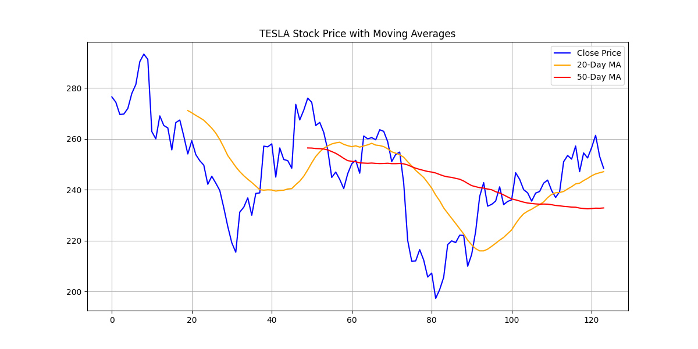
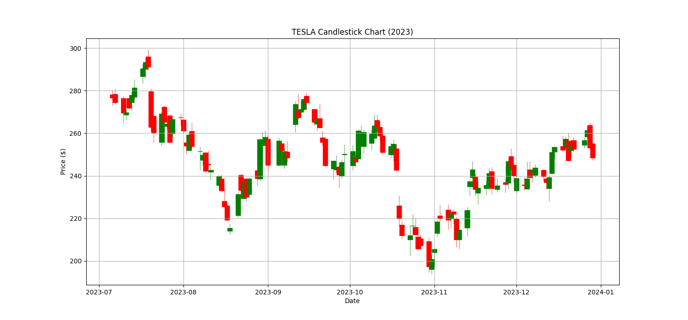
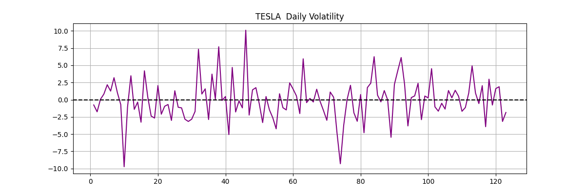

# 📈 Tesla Stock Market Analysis

This Python project analyzes historical Tesla stock data and generates visualizations including moving averages, candlestick charts, and daily volatility.

---

## 📂 Files Included

- `Stock Market Analysis.py` – The main script that loads the dataset and generates all visualizations.
- `TSLA_stock_data.csv` – Tesla stock data file (you must supply this).
- `moving_averages.png` – Line plot of close price with 20-day and 50-day moving averages.
- `candlestick.png` – Candlestick chart showing OHLC price data.
- `volatility.png` – Line chart showing daily percent changes (volatility).

---

## 📊 Features

### 1. **Moving Averages Plot**
- Calculates 20-day and 50-day moving averages.
- Plots them along with closing prices.

### 2. **Candlestick Chart**
- Converts date to matplotlib-friendly format.
- Displays OHLC chart with color-coded candles.

### 3. **Daily Volatility**
- Computes percentage change between consecutive close prices.
- Visualizes it as a line graph.

---

## 📦 Requirements

Install the required libraries:

```bash
pip install pandas matplotlib mplfinance
```

---

## ▶️ How to Run

1. Place your Tesla stock CSV file in the project folder. It should include these columns:
   ```
   Date, Open, High, Low, Close, Volume
   ```

2. Make sure the file is named `TSLA_stock_data.csv` or update the filename in the script.

3. Run the script:

```bash
python Stock\ Market\ Analysis.py
```

---

## 📸 Output Samples

### ✅ Moving Averages:


### ✅ Candlestick Chart:


### ✅ Daily Volatility:


---

## 🧠 Notes

- The dataset must have proper datetime format for the `"Date"` column.
- Ensure you have `matplotlib` and `mplfinance` installed for the candlestick chart.

---

## 👤 Author

- Developed by [Your Name]